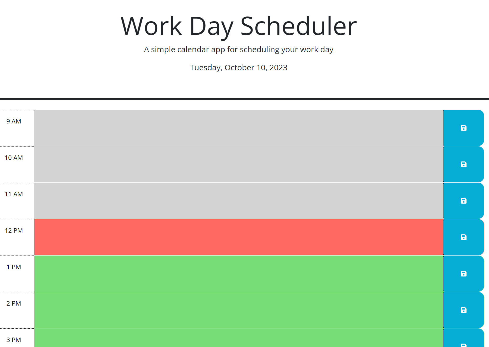

# 05 Third-Party APIs: Work Day Scheduler

## User Story

```md
AS AN employee with a busy schedule
I WANT to add important events to a daily planner
SO THAT I can manage my time effectively
```

## Acceptance Criteria

```md
GIVEN I am using a daily planner to create a schedule
WHEN I open the planner
THEN the current day is displayed at the top of the calendar
WHEN I scroll down
THEN I am presented with timeblocks for standard business hours of 9am&ndash;5pm
WHEN I view the timeblocks for that day
THEN each timeblock is color coded to indicate whether it is in the past, present, or future
WHEN I click into a timeblock
THEN I can enter an event
WHEN I click the save button for that timeblock
THEN the text for that event is saved in local storage
WHEN I refresh the page
THEN the saved events persist
```

## Application

The application is housed at https://shagomir.github.io/Simple-Calendar-Application/



## Developer Commentary

This app was created to simply and quickly create a calendar with the needed elements. Since everything stays on the page, I determined the easiest way to load it was to dynamically create the elements for each calendar block using the hours and a loop to ensure that everything came out looking okay. I also used day.js to generate the time and calendar elements to ensure they were correct and consistent. 

For the save function, it checks to see if it is a new day or if the data is blank, and will re-generate the stored calendar object if it is. If it is the same day and there are tasks, they will be loaded in during the creation loop. 

The save buttons use event delegation and jquery navigate the DOM, store the text in the calendar object, and then save the object to local memory. 

